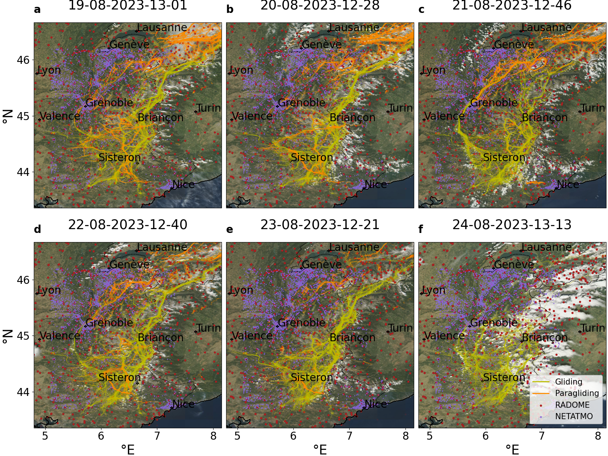
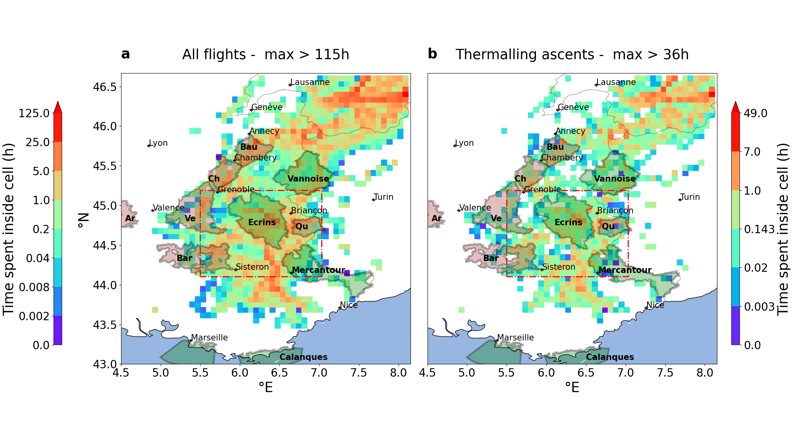
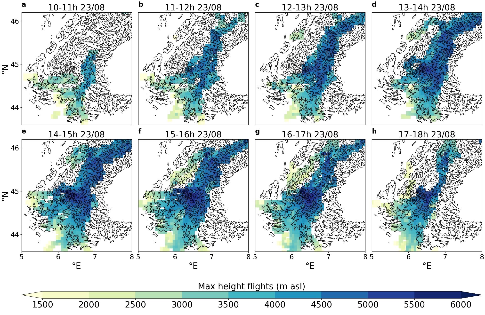
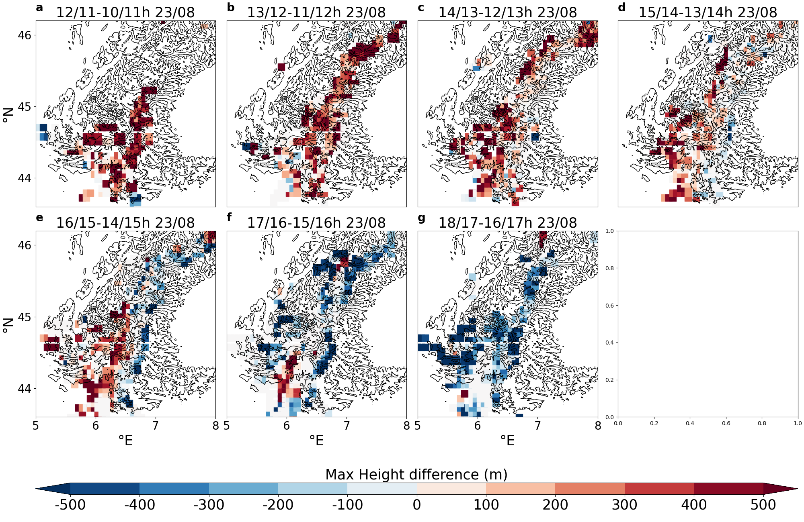
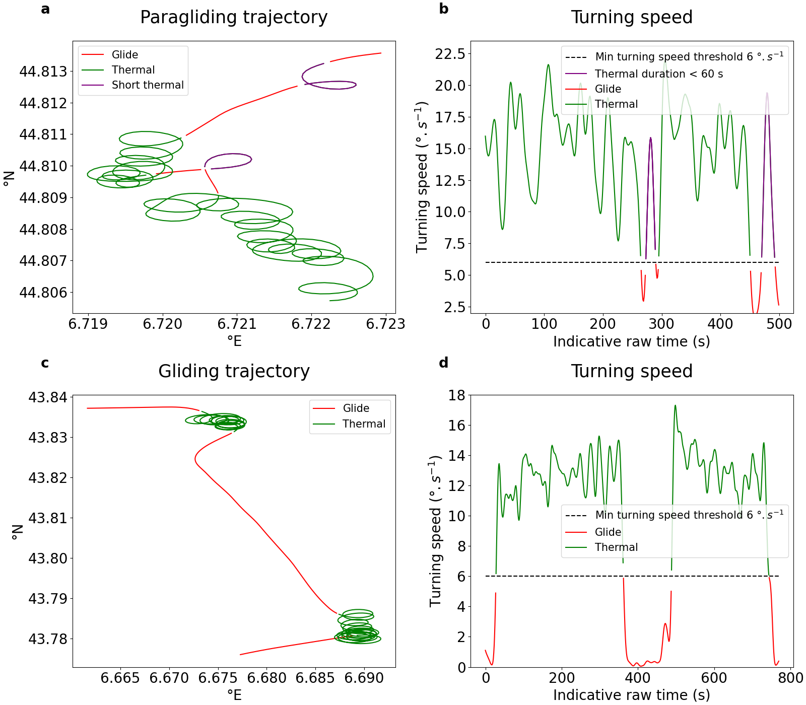
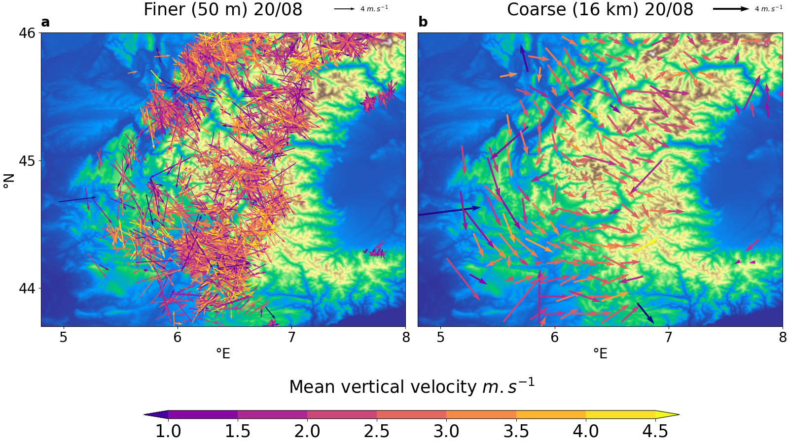
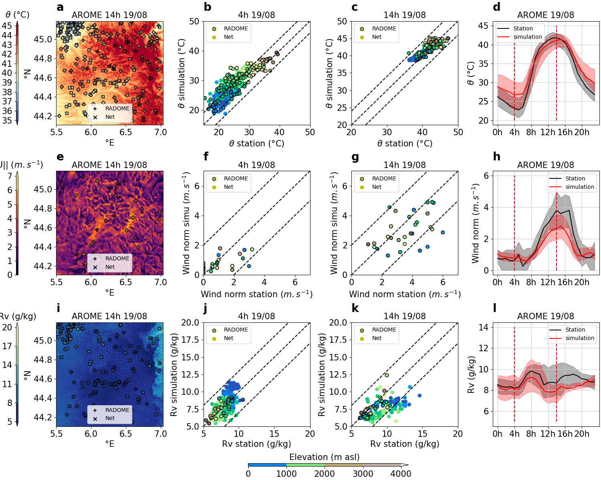
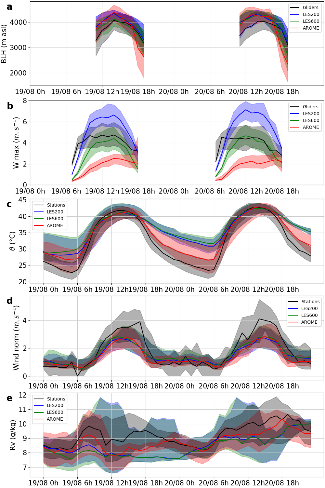
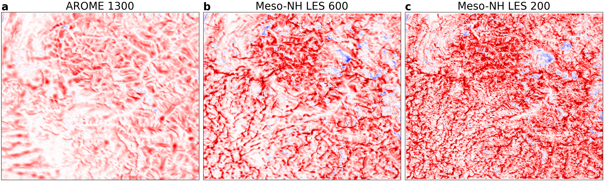

In the context of global warming, annual heat wave in the french Alps enable paragliders to land on the highest summits ("créneaux mont blancs"). Indeed, clear sky, no synoptic forcing meteorological conditions are idealised days for paragliding, but also 
for the modelisation of the orographic forcing of montain circulations. This 5 month internship aims at (i) using paragliding and gliding flights to image the amospheric boundary layer in the french Alps, (ii) comparing parametrized and non parametrized 
convection models and (iii) discussing the benefit of fine resolution of non parametrized convection models. In this study, the Application of Research to Operations at Mesoscale (AROME) and Mesoscale Non-Hydrostatic Meso-NH atmospheric models are applied 
in the southern Alps. The evaluation and intercomparison of simulated results are conducted with the RADOME and Netatmo meteorological stations for potential temperature, water vapor mixing ratio, horizontal wind norm and with paragliding and gliding flights
for the atmospheric boundary layer height and the vertical velocity field. The simulations evaluation shows that (i) Gliding and paragliding flights are unique and valid data to efficiently cover a large spatial and temporal extent within the ABL ; 
(ii) AROME show high skill for meteorological variables, whereas Meso-NH is a performing tool to simulate vertical velocities ; (iii) A higher resolution provides a better accuracy for a given atmospheric RCMs, though AROME 1.3 km proved better than 
Meso-NH 600 m and 200 m from meteorological variables. Overall, this study highlights the necessity to incorporate new data of atmospheric dynamics within the ABL, such as paragliding and gliding flights, to allow a full evaluation and tuning of RCMs, 
in particular over mountainous areas.

Here are displayed the more important figures of  the  report : 

Figure 1 – Atmospheric daily datasets available for this study over south-east France: Netatmo stations (purple
dots), RADOME stations (red dots) paragliding traces (orange lines), gliding traces (yellow lines) superposed
to a MODIS satellite view (time of occurrence in the title) of the surface including cloud cover from the 19𝑡 ℎ to
the 24𝑡 ℎ August 2023 (panels abcdef). Coastlines are solid black lines, borders dotted black lines.

Figure 6 – Time coverage by pilots (hours per day, described with a logarithmic scale) the 19𝑡 ℎ August (first
takeoff around 6 a.m., last landing around 8 p.m.) for (a) all traces including (b) thermalling ascent (defined
with the 4’s method), computed over a 10km resolution regular grid. National (green shading) and regional
(brown shading) natural parks. The simulation domain is the red square are

Figure 7 – Hourly maximum height reached by paragliding and gliding flights from 10 to 18h on a 10 × 10 km2
grid (n = 50 in section 3.3 on Sunday the 23𝑡 ℎ of August 2023. The background map shows 1000, 2000, 3000
iso-topography lines.

Figure 8 – Hourly variations of the maximum height reached by paragliding and gliding flights from 10 to 18h
on a 10 × 10 km2 grid (𝑛 = 50 in section 3.3) on Sunday the 23𝑡 ℎ of August 2023. The background map shows
1000, 2000, 3000 iso-topography lines.

Figure 4 – Latitude-longitude trajectories of (a) paraglider and (c) glider and their corresponding turning speeds
(bd). A thermal ascent is defined as a circular trajectory with a turning speed higher than 6 .𝑠−1lasting at least
60 seconds with a positive vertical speed (green curves). Trajectories with lower turning speeds (red curves)
or turning speed higher 6 .𝑠−1 during less than 60 seconds (purple curve) are considered as flight periods
corresponding to other flight displacement. Indicative circling drift speed in blue arrows.

Figure 10 – ABL’s horizontal and vertical wind inferred from paragliding and gliding data, as discuss in section
3.3, during Tuesday the 22𝑡 ℎ of August 2023, vertically projected on the surface. Colour, length and orientation
of the arrows represent respectively the vertical speed, the horizontal speed and the horizontal direction. (b) is
an interpolation of (a) on a regular grid of 16 × 16 km2 (𝑛 = 25 in 3.3) over the same domain. The background
map shows the topography.

Figure 11 – ABL’s height (abcd) and hourly maximum vertical velocities (efgh) the 19𝑡 ℎ of August on a
10 × 10 km2 grid (𝑛 = 50), estimated from flight data and from AROME simulations at 1.3 km resolution:
Spatial distribution (ae) of observations (dots) and model outputs (shading) and scatter plots simulation versus
observation between 11H00 and 12H00 (bf) and 14H00 to 15H00 (cg). To each scattered dot is assigned a color
referring to (b), (c) the 90𝑡 ℎ quantile of the underlying surface elevation distribution (within the corresponding
10 × 10 km2 box of the mesh) and (f),(g) the mean elevation of the thermalling ascent from paragliding flights
(black contour on the dots) and gliding flights (no black contour on the dots). The solid line represents the perfect
accordance between inferred and simulated values. The dashed lines the overestimation (resp. underestimation)
by the simulation of (b) and (c) 300 metres and (f) and (g) 1 𝑚.𝑠−1 over the inferred values. Daily cycles are
shown on (dh), with the median (solid line) and the interquartile range (shading).

Figure 14 – Potential temperature 𝜃 (abcd), horizontal wind norm ||𝑈ℎ || (efgh) and mixing ratio 𝑅𝑣 (ijkl) the
19𝑡 ℎ of August, observed by stations and from AROME simulations at 1.3 km resolution : Spatial distribution
(aeim) of observations (dots) and model outputs (shading) and scatter plots simulation versus observation at
4H00 (bfjn) and 14H00 (ciko). Each scattered dot is assigned a color referring to s Net (no black contour on
the dots) or RADOME (black contour on the dots) station’s elevation. The solid line represents the perfect
accordance between inferred and simulated values. The dashed lines the overestimation (resp. underestimation)
by the simulation of (bc) 4°C, (fg) 2 𝑚.𝑠−1, (jk) 3 𝑔.𝑘𝑔−1 over the inferred values. Daily cycles are shown on
(dhl), with the median (solid line) and the interquartile range (shading).

Figure 15 – Daily cycle of (a) 𝐴𝐵𝐿’s height (m asl), (b) maximum vertical speed (𝑚.𝑠−1), (c)
potential temperature 𝜃 (°C), (d) horizontal wind norm ||𝑈_ℎ|| (𝑚.𝑠−1) and (e) water vapor mixing
ratio 𝑅𝑣 (𝑔.𝑘𝑔−1) for observations (black line), Meso-NH LES 600 (green line), Meso-NH LES 200
(blue line) and AROME (red line) the 19𝑡 ℎ and 20𝑡 ℎ. The shading represent the interquartile range.

Figure 17 – Maximum vertical velocity of (a) AROME 1300 m (b) Meso-NH LES 600 m and (c) Meso-NH
LES 200 m at 12H00 on Sunday the 19𝑡 ℎ of August.
